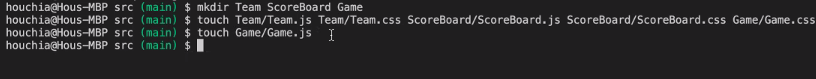
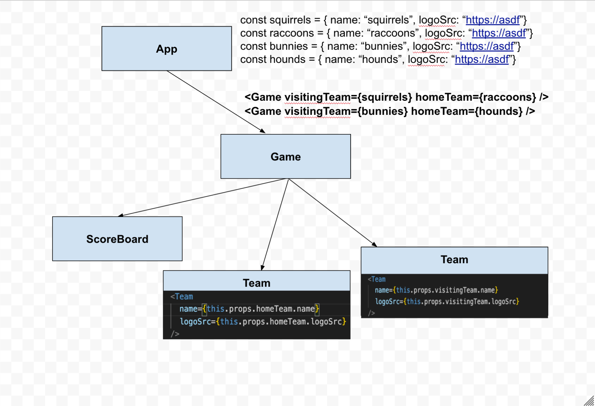

# React Recipe

1. Create a design for your React application. Identify the components you'd need for your application.
2. Within the `src` folder, create a new folder for each component you identified in Step 1. Each folder should contain the JS, CSS, and test files for that component. Use Pascal-casing to name your folder and file names.
3. In each JS file, bootstrap each component with some static data. Use the `rcc`/`rfc`/`rconst` shortcuts.
4. For each component, take a look at your design to decide what data needs to be stored within state versus props. Any part of the component that changes when the user interacts with the app needs to be stored in state. Any part of the component that needs to be customizable should be stored in props.

- Add state/props to your component.
- Replace the JSX in your component with values from either the state or the props, as appropriate.
- Build out the functionality of the component, including any event handlers.
- At this point, you might have to "lift state up" to the parent component, if your components need to share data between them.
- Repeat step 4 until all components are completed.

5. Once the app is working properly, add CSS to each component's CSS file to style your application.

## State

- setState, anytime you want to change state you want to call it. Pass to...

```
class App extends React.Component{
    constructor(){
        super()
        this.state = {
            count: 0
    }
    this.handleClick = this.handleClick.bind(this)
}
handleClick() {
    //must bind this method to the class
    //if I don't care I can pass in an obj and not care but I want to add more instead of simply saying 1 so I pass a function
    this.setState(prevState => {
        //returns new version of state of that object literal
        return {
            count: prevState.count + 1
        }
    })
}
```

## Notes on App

- Begin setup using cmd line:
  

- Look for repeated objects () that can be broken down into components

  - Then start out with nested components first since it's easier to create a child to interact with the parent component.
  - Each game would consist of two _teams_ (Russiaville Racoons look similiar so we can create 1 component) and a scoreboard.
  - Any part that is customizeable (animal name and img) should be stored in props that doesn't change with interaction so we can reuse vs. any part that is stored within the componenet should be stored in state.
  - The parent component is the **App** that wraps everything (or houses others) together & has other components nested.

- Visualize what we have with a diagram of the component hierarchy displayed as a tree:
  
- Hooking both child components from teams into **Game**
